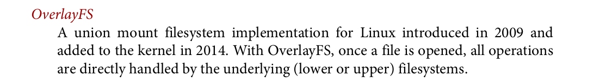

# Creating Partitions and Primary FileSystem:

- First we should know the name of SD Card (ex. /dev/sda) by using ``$ lsblk`` 

```bash
$ lsblk
sdc               8:32   1   3.7G  0 disk 
├─ sdc1           8:32   1   3.7G  0 disk 
```
> Acutally we got SD Card ``3.7`` Gbyte Here 

- Now We should ``umount`` **/sdc1**

So Simply We Can use ``$ umount /dev/sdc1``


- Lets figure out ``$ fdisk`` can Do

```shell
sami@linux:~/Desktop/SDCard$ sudo fdisk /dev/sdc 

Welcome to fdisk (util-linux 2.34).
Changes will remain in memory only, until you decide to write them.
Be careful before using the write command.


Command (m for help):
```
> m for help is a good option you know : )

 ### For Creating **Primary FileSystem**:
 
 ```shell
 sami@linux:~$ sudo fdisk /dev/sdc

Welcome to fdisk (util-linux 2.34).
Changes will remain in memory only, until you decide to write them.
Be careful before using the write command.

Command (m for help): n
 ```
  ```shell
Partition type
   p   primary (0 primary, 0 extended, 4 free)
   e   extended (container for logical partitions)
Select (default p): p
```
```bash
Partition number (1-4, default 1): 1
```
```bash
First sector (2048-7821311, default 2048): 2048
```
#### For Creating ``n`` Gbyte we could use this formula:


- as Sector size is **512 Byte** , for example lets try to make it **1 Gb** :

```bash
Last sector, +/-sectors or +/-size{K,M,G,T,P} (2048-7821311, default 7821311): 2099200
```

and yes 
```bash

Created a new partition 1 of type 'Linux' and of size 1 GiB. #<<<<

Command (m for help): w
The partition table has been altered.
Calling ioctl() to re-read partition table.
Syncing disks.
sami@linux:~$ 
```

- After that we should create a filesystem on a storage device

```bash
sudo mkfs -t ext4 /dev/sdc1 
```

```
mke2fs 1.45.5 (07-Jan-2020)
Found a dos partition table in /dev/sdb1
Proceed anyway? (y,N) y
Creating filesystem with 262144 4k blocks and 65536 inodes
Filesystem UUID: 5d63ccc6-e7d7-4a68-b729-1150f43422e8
Superblock backups stored on blocks: 
	32768, 98304, 163840, 229376

Allocating group tables: done                            
Writing inode tables: done                            
Creating journal (8192 blocks): done
Writing superblocks and filesystem accounting information: done #<<---
```

- Finally we can now mount our filesystem
```bash
sudo mount -t ext4 /dev/sdc1 ~/Desktop/sdcard/
```


----
----


# File-System stack Use-case:

## Task A: Configuring Read-Only Directory with OverlayFS


 
> 

So first we should do ``3`` directories:

- **upper directory:** a **new writable directory** where we'll place our configuration file.

- **work directory:**   a temp directory used internally by overlayfs.

- **Merged directory:** point to the **Combined** read-only /etc directory .
```bash
sudo mkdir -p /PROJ/etc_upper /PROJ/etc_work /PROJ/etc_merged
```
- Do not forget to change ``/PROJ/`` with your real working Directory
```bash
sudo mount -t overlay overlay -o lowerdir=/etc,upperdir=/PROJ/etc_upper,workdir=/PROJ/etc_work /PROJ/etc_merged
```
- Now we can add our Configuration Files o the new writable overlay directory
:
```bash
sudo cp Config.conf /PROJ/etc_merged
```
> for Automate overlay :

```bash
sudo vi /etc/fstab
```
- Add those lines:

```bash
overlay /data/etc_merged overlay lowerdir=/etc,upperdir=/PROJ/etc_upper,workdir=/PROJ/etc_work 0 0
```

- **!!** Do not forget to change ``/PROJ/`` with your real project directory **!!**

---
## Task B: What is the linux behavior in the following situations ?

> Context:
You need to mount a file system onto a directory that already contains some files.
Challenge:
● What is the linux behavior in this case ?

#### Lets try it why not?

- I've created a primary partition with ``1 Gbyte`` using my tiny SDCard 
```shell
sdb           8:16   1   3.7G  0 disk 
└─sdb1        8:17   1     1G  0 part 
```
- Let's mount it to an existing directory:
```shell
sami@linux:~/Desktop/sdcard$ tree
.
├── binaryHOLA
└── hello.c
0 directories, 2 files
```
```shell
sami@linux:~/Desktop/sdcard$ sudo mount -t ext4 /dev/sdb1 ~/Desktop/sdcard/
sami@linux:~/Desktop/sdcard$ lsblk
..
sdb           8:16   1   3.7G  0 disk 
└─sdb1        8:17   1     1G  0 part /home/sami/Desktop/sdcard
```
```bash
sami@linux:~/Desktop/sdcard$ ls
lost+found #ALOOOO
```
### let's figure out why ?

1. `lost+found` directory is reserved in Linux filesystems for orphaned files.
2. Mounting :
    - an **empty** directory overlays it, making mounted files accessible.
    - Non-empty directory mount depends on filesystem type.
        - `Network filesystems` **hide** original contents, making them inaccessible.
        - `Local filesystems` usually error when mounted on non-empty directories to prevent data loss.
3. lost+found it becomes visible once the filesystem is mounted onto the directory. 
```bash
sami@linux:~$ sudo umount /dev/sdb1 # umount it
sami@linux:~$ cd ~/Desktop/sdcard
sami@linux:~/Desktop/sdcard$ tree
.
├── binaryHOLA
└── hello.c # hola my data came back
0 directories, 2 files
```


> **Key Point**s: 
 @ Linux prioritizes data safety by preventing accidental overwrites. 
@ Empty directories are safe for mounting, as there's no existing data to lose.
@ Network filesystem behavior can vary; always refer to specific documentation.

