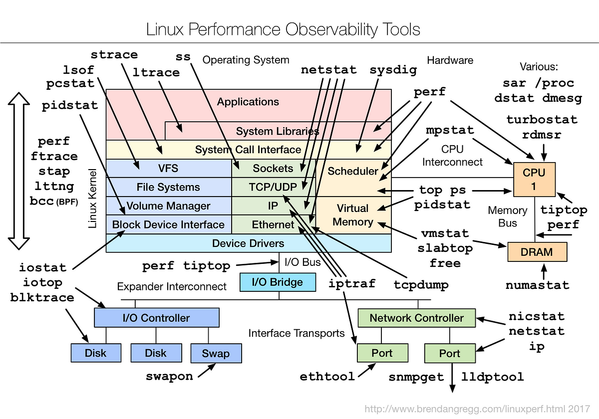

# Network Stack

### Configuration of Static IP on Linux

- Identification:
    - ``ifconfig`` : configure a network interface
, Interface cards up only
    - ``ip`` :  show routing, network devices, interfaces

``` sh
#Disable eth0 interface:
ifconfig eth0 down

#Enable eth0 interface:
ifconfig eth0 up

# Make an interface up/down:
ip link set {{interface}} {{up|down}}
```
- Setting a Static IP:
```bash
- Setting a Static IP:
#sami@linux:/etc/NetworkManager/system-connections$
sudo nmcli connection modify Ahmed ipv4.method manual ipv4.addresses 192.168.1.10/24

```
- Restarting NetworkManager:
```bash
sudo restart systemctl NetworkManager
```
---

### Debbuging 
How to debugging within Network Interface Cards (NIC) 

>Linux Performance Observability Tools



- ``ethtool`` : check if there is a link between driver and interface card
- ``tcpdump`` : Captures and analyzes network packets to help diagnose network issues.
- ``Ping`` : Tests connectivity between two nodes on a network, verifying if a host is reachable.