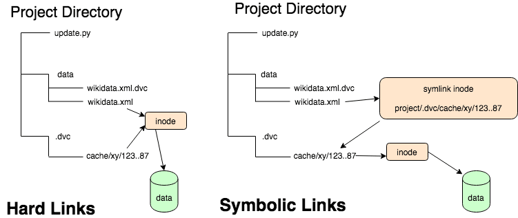

# FileSystem Stack: Use Case

---

## 1- Create FHS (File Hierarchy Standard) Directories:

- Create the five most common directories as per the File Hierarchy
Standard (FHS) on this file system.

- using ``$ mkdir <DIR>`` also ``$ vim content.txt``

- So, We Create those ``usr`` ``bin`` ``etc`` ``lib`` ``boot``

``` bash
man hier |less | grep <DIR>
```

- **``/bin``** : This directory contains executable programs which are needed in single user mode and to bring the system up or repair it. staller and configuration files should go to /sbin and /etc.  The operating system kernel (initrd for example) must be located in either ,These directories are variants of /lib on system which support more than one binary format requiring separate libraries (optional).

- **``/usr``** : This directory is usually mounted from a separate partition.  It should hold only shareable, read-only data, so that it can be mounted  by various machines running Linux.

- **``/lib``** : This directory should hold those shared libraries that are necessary to boot the system and to run the commands in the root filesystem. staller and configuration files should go to /sbin and /etc.  The operating system kernel (initrd for example) must be located in either 

- **``/etc``** : Contains  configuration  files which are local to the machine.  Some larger software packages, like X11, can have their own subdirectories


- **``/boot``** : Contains  static  files  for  the boot loader.  This directory holds only the files which are needed during the boot process.  The map in‐
or /boot.

```bash
$ tree

├── bin
│   └── content.txt
├── boot
│   └── content.txt
├── etc
│   └── content.txt
├── lib
│   └── content.txt
└── usr
    └── content.txt
```
---
## 2- Create Symbolic link and Hard link:


- ### for Use Case Example:
- 1- Create a directory for HardLink ``$ mkdir Hardlink``
- 2- Create a txt file rootHard.txt using ``$ vim rootHard.txt``

```bash
├── HardLink
│   ├── Link
│   │   └── secHard2.txt
│   └── rootHard.txt
```
 - 3- Create a hard link to a file:
 ``` bash
   ln {{/path/to/file}} {{path/to/hardlink}}
 ```  


- 4- `` $ cat rootHard.txt cat secHard2.txt``
```bash
$cat rootHard.txt Link/secHard2.txt
>Hello World

Hello from HardLink

>Hello World

Hello from HardLink

```
---
- to Create a `` symbolic link ``to a file or directory:


``` bash
ln -s {{/path/to/file_or_directory}} {{path/to/symlink}}
```

``` bash
.
├── rootSoft.txt
└── secSoft.txt -> rootSoft.txt
```
---

---
>**In Linux, the size of a symbolic link is typically larger than the size of the target file it points to. The reason for this is that a symbolic link contains ``the path or relative path to the target file``, and that path information takes up space.**
---


- ``$ stat rootSoft.txt``

```bash
  File: rootSoft.txt
  Size: 16        	Blocks: 8          IO Block: 4096   regular file

```
- ``$ stat secSoft.txt``

```bash
  File: secSoft.txt -> rootSoft.txt
  Size: 12        	Blocks: 0          IO Block: 4096   symbolic link

```
>**The size of a symbolic link is determined by the length of the path it contains. The actual content of the target file does not affect the size of the symbolic link.**
---


# FileSystem Stack


- **Partition**: Logical division of a disk for organizing data and filesystems.
- **Volume**: Abstract storage unit that can span multiple partitions or disks.
- **Super Block**: Metadata structure containing information about a filesystem, like size and status.
- **Inodes**: Data structures holding metadata (like permissions and timestamps) for each file.
---
- ``$ stat``

```bash
sami@linux:~/Downloads$ stat ./Binary 
  File: ./Binary
  Size: 18136     	Blocks: 40         IO Block: 4096   regular file
Device: 10307h/66311d	Inode: 1336431     Links: 1
Access: (0777/-rwxrwxrwx)  Uid: ( 1000/    sami)   Gid: ( 1000/    sami)
Access: 2024-05-16 16:52:38.947585150 +0300
Modify: 2024-05-16 16:51:40.903602814 +0300
Change: 2024-05-16 16:52:33.739586365 +0300
 Birth: -

```
- ``$ df -i /dev/sda``
```bash
sami@linux:~$ df -i /dev/sda
Filesystem      Inodes IUsed   IFree IUse% Mounted on
udev           2001367   756 2000611    1% /dev
```

> Now we see Inodes: ``Inode: 1336431 `` , ``Inodes 2001367``
